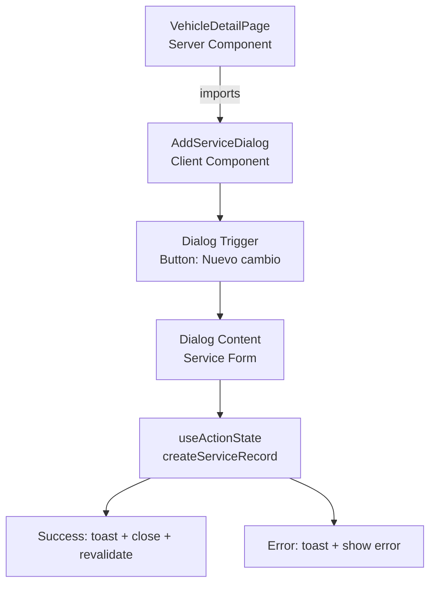

# Fix: "Nuevo cambio" Button Not Working

## Problem

The vehicle detail page (`src/app/(dashboard)/vehicles/[vehicleId]/page.tsx`) is a **Server Component** (async, no `"use client"`). The "Nuevo cambio" button on line 122-125 is a static `<Button>` with no interactivity — no `onClick`, no form association, no dialog trigger. Since Server Components cannot handle client-side interactivity, clicking the button does nothing.

## Solution

Create a **Client Component** (`"use client"`) that encapsulates the button, dialog, and form, then import it into the server page.

## Architecture



## Files to Create/Modify

### 1. CREATE: `src/components/vehicles/add-service-dialog.tsx`

A Client Component with:
- `"use client"` directive
- `Dialog` from `@/components/ui/dialog` wrapping the form
- `useActionState` hook bound to `createServiceRecord` server action
- Form fields:
  - `vehicleId` (hidden, passed as prop)
  - `serviceDate` (date input, default today)
  - `mileageAtService` (number input)
  - `type` (Select: "Arreglo", "Service", "Upgrade")
  - `description` (Textarea, optional)
  - `cost` (number input, optional)
- `toast` from `sonner` for success/error feedback
- `useRouter().refresh()` to revalidate the server component after success
- Auto-close dialog on successful submission

### 2. MODIFY: `src/app/(dashboard)/vehicles/[vehicleId]/page.tsx`

- Import `AddServiceDialog` from `@/components/vehicles/add-service-dialog`
- Replace the static `<Button>` block (lines 122-125) with `<AddServiceDialog vehicleId={vehicleId} currentMileage={vehicle.currentMileage} />`

## Data Flow

1. User clicks "Nuevo cambio" → Dialog opens
2. User fills form → Submits via `useActionState` → `createServiceRecord` server action
3. On success: toast "Servicio registrado", dialog closes, page refreshes to show new record
4. On error: toast shows error message, form stays open

## Component Props

```typescript
interface AddServiceDialogProps {
  vehicleId: string;
  currentMileage: number;
}