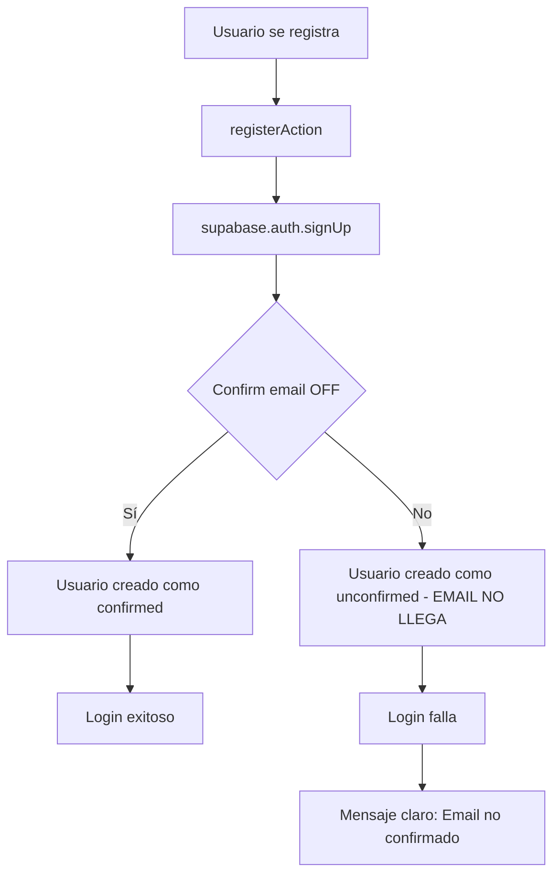

# Plan: Arreglar Registro/Login — Confirmación de Email

## Diagnóstico

### Flujo actual

1. **Registro** → [`registerAction`](src/lib/actions/auth-actions.ts:56) llama a `supabase.auth.signUp()` → Crea usuario en Supabase Auth con estado `unconfirmed` → Inserta registro en tabla `mechanics` → Redirige a `/login`
2. **Login** → [`loginAction`](src/lib/actions/auth-actions.ts:26) llama a `supabase.auth.signInWithPassword()` → Falla porque el email no está confirmado → Muestra error genérico

### Causa raíz

Supabase Auth tiene **email confirmation habilitado por defecto**. Al registrarse, se envía un email de confirmación, pero **nunca llega**. Esto puede deberse a:

- El proyecto Supabase no tiene **SMTP configurado** (en la capa gratuita de Supabase, los emails de confirmación se envían desde un servicio compartido con límites de rate, y a menudo terminan en spam o no se entregan)
- El email está yendo a la carpeta de **spam**
- El **servicio de email de Supabase** no está funcionando correctamente para este proyecto

---

## Solución Implementada

### Opción elegida: Deshabilitar confirmación de email + Mejorar mensajes de error

**Dónde (configuración)**: [Supabase Dashboard](https://supabase.com/dashboard) → Authentication → Settings → **Confirm email** = OFF

**Cambios de código realizados**:

| Archivo | Cambio |
|---------|--------|
| [`src/lib/actions/auth-actions.ts`](src/lib/actions/auth-actions.ts) | Se mejoró [`loginAction`](src/lib/actions/auth-actions.ts:31) para detectar errores de "Email not confirmed" y mostrar un mensaje claro en español |
| [`src/app/(auth)/register/page.tsx`](src/app/(auth)/register/page.tsx) | Se actualizó el mensaje de éxito de "Revisá tu correo para confirmar" a "Cuenta creada correctamente. Ya podés iniciar sesión" |

### Detalle de cambios

#### 1. [`src/lib/actions/auth-actions.ts`](src/lib/actions/auth-actions.ts) — `loginAction`

Se agregó detección del error `Email not confirmed`:

```typescript
if (error) {
  const message = error.message.toLowerCase();
  if (
    message.includes("email not confirmed") ||
    message.includes("email_not_confirmed")
  ) {
    return {
      success: false,
      error:
        "Email no confirmado. Revisá tu bandeja de entrada o contactá al administrador del sistema.",
    };
  }
  return { success: false, error: error.message };
}
```

#### 2. [`src/app/(auth)/register/page.tsx`](src/app/(auth)/register/page.tsx) — Mensaje de éxito

Antes: `"Cuenta creada. Revisá tu correo para confirmar."`
Después: `"Cuenta creada correctamente. Ya podés iniciar sesión."`

---

## Instrucciones post-implementación

### Paso obligatorio: Deshabilitar confirmación de email en Supabase

1. Ir a [Supabase Dashboard](https://supabase.com/dashboard)
2. Seleccionar el proyecto de GarageHub
3. Navegar a **Authentication** → **Settings** (en la sidebar izquierda)
4. Buscar la sección **Email Confirmations**
5. Desactivar el toggle **Confirm email**
6. Hacer clic en **Save**

> ⚠️ **Importante**: Sin este paso, los usuarios nuevos seguirán creándose como `unconfirmed` y no podrán iniciar sesión aunque el mensaje de error ahora sea más claro.

### Verificación

1. Registrarse con un email y contraseña nuevos
2. Ser redirigido a `/login`
3. Iniciar sesión con las mismas credenciales
4. Debería acceder al dashboard sin problemas

---

## Diagrama del flujo corregido



---

## Notas adicionales

- Si en el futuro se quiere agregar verificación de email, se deberá configurar un **SMTP real** (SendGrid, Resend, etc.) en Supabase Dashboard → Authentication → Settings → SMTP Settings
- La tabla `mechanics` se sigue insertando correctamente durante el registro, independientemente del estado de confirmación del email